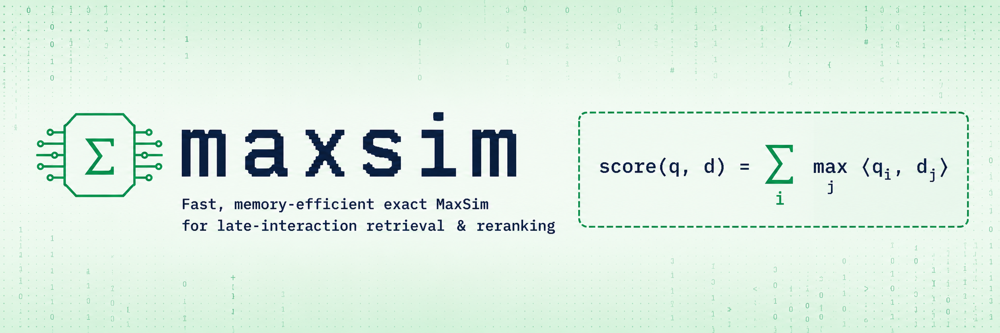

# maxsim

A fast, memory-efficient exact MaxSim kernel for late-interaction
retrieval and reranking (PyLate / ColBERT-style), packaged as a
[Hugging Face `kernels`](https://github.com/huggingface/kernels) repo.

The kernel computes

```
score(q, d) = sum_i max_j  <q_i, d_j>
```

over a batch of `(query, document)` pairs **without materialising the
full `[Lq, Ld]` similarity matrix**. It tiles over document tokens,
keeps running per-q-token maxima in shared memory, and reduces those
into the per-pair score.

## Install

```bash
uv add kernels        # or: pip install kernels
```

## Usage

Two entry points. The packed/ragged form is the canonical kernel-facing
API; the padded form is an ergonomic wrapper around the same kernel for
the common batched-reranking case.

### Packed (ragged segments)

```python
import torch
from kernels import get_kernel

maxsim = get_kernel("erikkaum/maxsim", version=1)

scores = maxsim.score_pairs_packed(
    queries,           # [total_q_tokens, dim]
    query_offsets,     # [num_queries + 1], int32/int64
    documents,         # [total_d_tokens, dim]
    document_offsets,  # [num_documents + 1], int32/int64
    pair_query_ids,    # [num_pairs]
    pair_document_ids, # [num_pairs]
)
# scores.shape == [num_pairs], dtype == float32
```

### Padded (batched reranking)

```python
scores = maxsim.score_candidates_padded(
    queries,        # [B, Lq, dim]
    documents,      # [B, candidates, Ld, dim]
    query_lengths,  # [B]
    doc_lengths,    # [B, candidates]
)
# scores.shape == [B, candidates], dtype == float32
```

A pure-PyTorch reference (`maxsim.maxsim_reference`,
`maxsim.score_pairs_packed_reference`,
`maxsim.score_candidates_padded_reference`) ships alongside for tests
and benchmarks.

## Supported

| Backend | Devices                | Input dtypes      | Accum / output |
| ------- | ---------------------- | ----------------- | -------------- |
| Metal   | Apple Silicon (MPS)    | fp32 / fp16 / bf16 | fp32           |
| CUDA    | sm_80, sm_86, sm_89 (Ampere + Lovelace) | fp32 / fp16 / bf16 | fp32 |

`dim` is generic; the fast `simdgroup_matrix` / WMMA paths fire when
`dim % 8 == 0` (Metal) / `dim % 16 == 0` (CUDA), which covers the
typical embedding sizes (64 / 96 / 128).

## Benchmarks

Three padded-API workloads taken straight from the design plan,
comparing the kernel to a vectorised but naïve PyTorch baseline that
materialises the `[Lq, Ld]` similarity matrix.

### Apple M3 Pro (Metal, fp16, dim=128)

| Workload                                                       | Kernel | Naive  | Speedup |
| -------------------------------------------------------------- | ------ | ------ | ------- |
| SmallRerank — B=32, C=10,  Lq=32, Ld=180                      | 0.45 ms | 1.44 ms | **3.18×** |
| HeavyRerank — B=32, C=100, Lq=32, Ld=256                      | 4.34 ms | 16.63 ms | **3.83×** |
| LongDocStress — B=8, C=16, Lq=64, Ld=1024                     | 1.69 ms | 3.70 ms | **2.19×** |

### NVIDIA CUDA (fp16, dim=128)

| Workload      | A10G (sm_86) | L4 (sm_89) | A100 (sm_80) |
| ------------- | ------------ | ---------- | ------------ |
| SmallRerank   | 2.28×        | 2.05×      | 2.80×        |
| HeavyRerank   | **4.48×**    | **5.18×**  | **5.29×**    |
| LongDocStress | 3.41×        | **6.21×**  | 1.89×        |

(A100's naive einsum is so well-tuned by cuBLAS that LongDocStress
barely benefits there; on memory-bandwidth-bound GPUs like L4 the
kernel pulls ahead significantly.)

Reproduce with:

```bash
kernels benchmark erikkaum/maxsim
```

## Limitations

- No backward pass (forward-only scoring kernel for now).
- No argmax-position output (just the score).
- CUDA fast path requires `dim % 16 == 0` and `Lq_max % 16 == 0`; other
  shapes fall back to a correctness-preserving scalar kernel.
- Hopper (sm_90) is supported via PTX forward-compat but doesn't yet
  use WGMMA — Ampere/Lovelace gets the best tuning.

## Source / contribute

Source: <https://github.com/erikkaum/maxsim>.

License: Apache-2.0.
